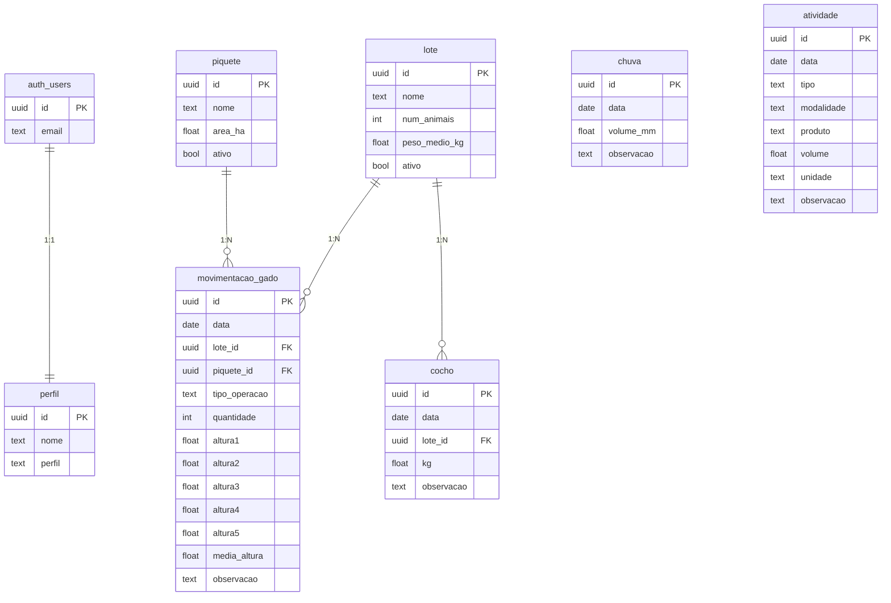
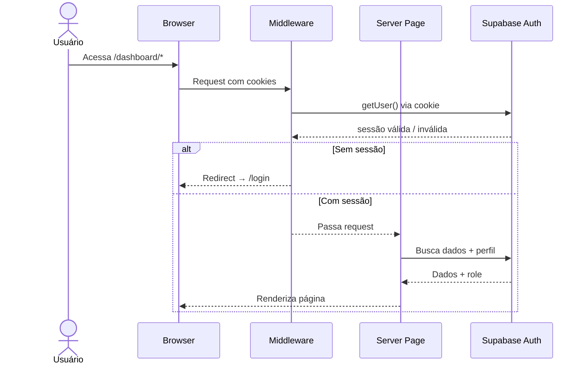
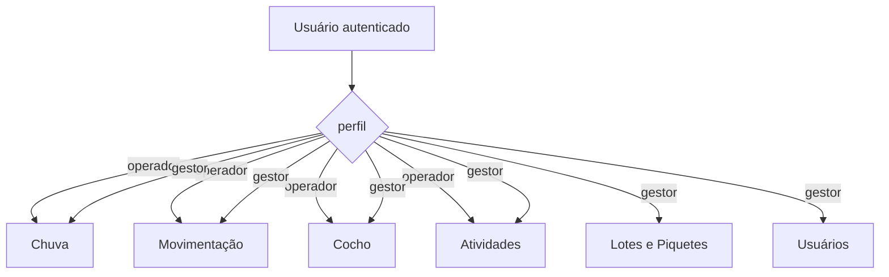
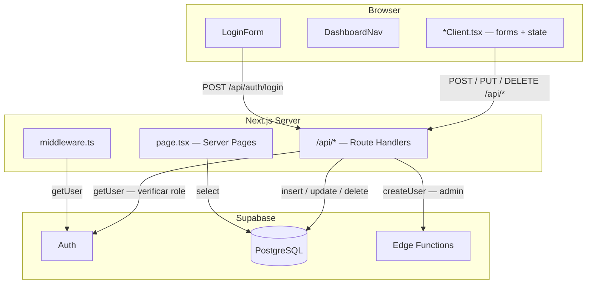
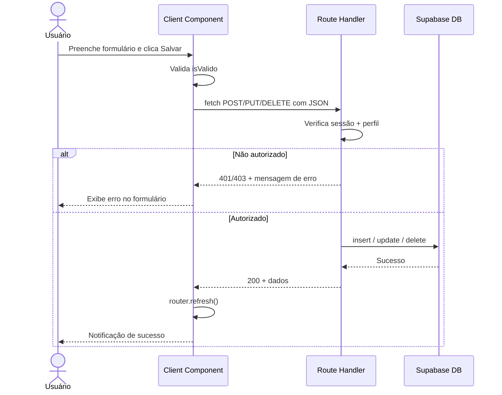

# Fazenda Viçosa — Sistema de Gestão Rural

Aplicação web para gerenciamento de atividades de uma fazenda, incluindo movimentação de gado, controle de chuvas, distribuição de ração, atividades no campo e gestão de usuários. Desenvolvida com Next.js 15 App Router, Supabase e Tailwind CSS.

---

## Sumário

- [Visão Geral](#visão-geral)
- [Stack Tecnológica](#stack-tecnológica)
- [Arquitetura](#arquitetura)
- [Estrutura de Pastas](#estrutura-de-pastas)
- [Módulos](#módulos)
- [Banco de Dados](#banco-de-dados)
- [Autenticação e Autorização](#autenticação-e-autorização)
- [Padrões de Engenharia](#padrões-de-engenharia)
- [Diagramas](#diagramas)
- [Configuração do Ambiente](#configuração-do-ambiente)

---

## Visão Geral

O sistema permite que gestores e operadores registrem e acompanhem:

| Módulo | Acesso | Descrição |
|---|---|---|
| Chuva | Todos | Volume de precipitação diário |
| Movimentação de Gado | Todos | Entrada e saída de lotes nos piquetes, com 5 medições de altura do pasto |
| Cocho | Todos | Distribuição de ração por lote |
| Atividades no Campo | Todos | Adubação, herbicida e roçagem com modalidade, produto e volume |
| Lotes e Piquetes | Gestor | Criação e edição de lotes de gado e piquetes |
| Usuários | Gestor | Criação, edição e exclusão de operadores |

---

## Stack Tecnológica

| Camada | Tecnologia |
|---|---|
| Framework | Next.js 15 (App Router) |
| Linguagem | TypeScript 5 |
| UI | React 19 + Tailwind CSS 4 |
| Backend/BaaS | Supabase (PostgreSQL + Auth + Edge Functions) |
| Auth SSR | @supabase/ssr |
| Fontes | Geist, Merriweather, Poppins |
| Linting | ESLint 9 + eslint-config-next |

---

## Arquitetura

O projeto segue o padrão **Server-Client Split** do Next.js App Router:

```
Browser  ──→  Next.js Server  ──→  Supabase (PostgreSQL)
                  │                       │
             Server Pages           Supabase Auth
           (fetch inicial)        (sessão via cookies)
                  │
             Client Components
           (interatividade)
                  │
             Route Handlers
           (/api/* REST interna)
                  │
             Supabase Admin
           (operações privilegiadas)
```

**Fluxo de dados:**

1. O middleware valida a sessão em cada request a `/dashboard/*`
2. Server Pages buscam os dados iniciais no Supabase e passam como props
3. Client Components gerenciam estado local e formulários
4. Mutações disparam chamadas às Route Handlers (`/api/*`)
5. As Route Handlers validam dados, verificam perfil e persistem no Supabase
6. `router.refresh()` no cliente força a re-busca server-side após mutação

---

## Estrutura de Pastas

```
fazenda-app/
├── app/
│   ├── api/                        # Route Handlers (REST interna)
│   │   ├── auth/
│   │   │   ├── login/route.ts
│   │   │   └── logout/route.ts
│   │   ├── atividades/
│   │   │   ├── route.ts            # POST
│   │   │   └── [id]/route.ts       # PUT, DELETE
│   │   ├── chuva/
│   │   │   ├── route.ts
│   │   │   └── [id]/route.ts
│   │   ├── cocho/
│   │   │   ├── route.ts
│   │   │   └── [id]/route.ts
│   │   ├── lotes/
│   │   │   ├── route.ts
│   │   │   └── [id]/route.ts
│   │   ├── movimentacao/
│   │   │   ├── route.ts
│   │   │   └── [id]/route.ts
│   │   ├── piquetes/
│   │   │   ├── route.ts
│   │   │   └── [id]/route.ts
│   │   └── usuarios/
│   │       ├── route.ts
│   │       └── [id]/route.ts
│   ├── components/
│   │   ├── DashboardNav.tsx        # Navegação lateral/inferior
│   │   └── LoginForm.tsx           # Formulário de login
│   ├── dashboard/
│   │   ├── layout.tsx              # Layout autenticado com nav
│   │   ├── page.tsx                # Home com cards de módulos
│   │   ├── atividades/
│   │   │   ├── page.tsx            # Server Page
│   │   │   └── AtividadesClient.tsx
│   │   ├── chuva/
│   │   │   ├── page.tsx
│   │   │   └── ChuvaClient.tsx
│   │   ├── cocho/
│   │   │   ├── page.tsx
│   │   │   └── CochoClient.tsx
│   │   ├── lotes/
│   │   │   ├── page.tsx
│   │   │   └── LotesClient.tsx
│   │   ├── movimentacao/
│   │   │   ├── page.tsx
│   │   │   └── MovimentacaoClient.tsx
│   │   └── usuarios/
│   │       ├── page.tsx
│   │       ├── UsuariosClient.tsx
│   │       └── UsuarioForm.tsx
│   ├── lib/
│   │   └── supabase/
│   │       ├── server.ts           # Client SSR (cookies)
│   │       ├── client.ts           # Client browser
│   │       └── admin.ts            # Client service role
│   ├── login/
│   │   └── page.tsx
│   ├── globals.css                 # Tokens CSS + Tailwind
│   ├── layout.tsx                  # Root layout (fontes, metadata)
│   └── page.tsx                    # Redirect → /login
├── middleware.ts                   # Proteção de rotas
├── next.config.ts
├── tsconfig.json
└── package.json
```

---

## Módulos

### Chuva
Registro do volume de precipitação (mm) por data. Permite criar, editar e excluir registros. Validação impede datas futuras e volumes negativos.

### Movimentação de Gado
Registra entrada e saída de lotes nos piquetes. Campos:
- **Entrada:** lote, piquete (apenas os desocupados), quantidade de animais, 5 medições de altura do pasto (calcula média automaticamente)
- **Saída:** lote, piquete atual (preenchido automaticamente), 5 medições de altura

### Cocho
Controle de distribuição de ração por lote. Vinculado ao lote e à data, registra o volume em kg fornecido.

### Atividades no Campo
Três tipos de atividade com campos específicos por tipo:

| Tipo | Modalidades | Produto | Unidade |
|---|---|---|---|
| Adubação | Manual, Trator | Opcional | Sacos (25/30/40/50) ou Kg (5–100) |
| Herbicida | Costal, Stihl, Trator | Obrigatório | Baldes (5/10/15/20) ou Jatão (100–400) |
| Roçagem | Foice, Roçadeira, Enxada | Opcional | — |

### Lotes e Piquetes (Gestor)
CRUD completo para lotes (nome, nº animais, peso médio) e piquetes (nome, área em hectares). Acesso restrito ao perfil `gestor`.

### Usuários (Gestor)
Criação via Supabase Edge Function (garante criação na `auth.users` e na `perfil`). Edição de nome, email e senha. Proteção contra auto-exclusão.

---

## Banco de Dados

### Diagrama de Entidades



---

## Autenticação e Autorização

### Fluxo de Autenticação



### Níveis de Acesso



---

## Padrões de Engenharia

### Server/Client Split
Cada módulo separa responsabilidades em dois arquivos:
- `page.tsx` — Server Component: busca dados no Supabase com permissões de servidor, sem expor credenciais ao cliente
- `*Client.tsx` — Client Component: gerencia estado local, formulários e chamadas à API interna

### BFF (Backend for Frontend)
As Route Handlers (`/api/*`) atuam como uma camada BFF: validam input, verificam autorização e encapsulam a lógica de acesso ao Supabase. O cliente nunca acessa o Supabase diretamente para mutações.

### Role-Based Access Control (RBAC)
Implementado em dois níveis:
1. **Middleware** — bloqueia acesso a `/dashboard/*` sem sessão válida
2. **Route Handlers** — verificam `perfil === 'gestor'` antes de executar operações privilegiadas (lotes, piquetes, usuários)

### Optimistic UI com Server Refresh
Após cada mutação bem-sucedida, o cliente chama `router.refresh()` para re-executar as Server Pages, garantindo que a UI reflita o estado real do banco sem precisar de estado global ou cache manual.

### Controlled Forms com Validação Incremental
Todos os formulários usam estado controlado (`useState`) com um flag `isValido` derivado dos campos. O botão de salvar permanece desabilitado até que todos os campos obrigatórios estejam preenchidos, sem depender de bibliotecas de formulário externas.

### Supabase Client por Contexto
Três clientes distintos evitam vazamento de credenciais:
- `server.ts` — usado em Server Components e Route Handlers (cookie-based, sem expor chave ao browser)
- `client.ts` — usado em Client Components (chave anon pública)
- `admin.ts` — usado apenas em Route Handlers que precisam de privilégios de service role (criação de usuários via Auth Admin API)

### Tipo Discriminado para Modo de Formulário
```typescript
type Modo = { tipo: 'criar' } | { tipo: 'editar'; registro: Entidade }
```
Elimina flags booleanos (`isEditing`, `editingId`) e garante via TypeScript que o registro sempre existe no modo editar.

### Design Tokens via CSS Custom Properties
Todas as cores do sistema são definidas como variáveis CSS em `globals.css` (`--primary`, `--accent`, `--error`, etc.), permitindo consistência visual sem bibliotecas de temas.

---

## Diagramas

### Arquitetura Completa



### Fluxo de Mutação (CRUD)



---

## Configuração do Ambiente

### Pré-requisitos
- Node.js 18+
- Conta no [Supabase](https://supabase.com)

### Variáveis de Ambiente

Crie um arquivo `.env.local` na raiz do projeto:

```env
NEXT_PUBLIC_SUPABASE_URL=https://<seu-projeto>.supabase.co
NEXT_PUBLIC_SUPABASE_ANON_KEY=<sua-anon-key>
SUPABASE_SERVICE_ROLE_KEY=<sua-service-role-key>
```

### Instalação e Execução

```bash
npm install
npm run dev       # desenvolvimento em http://localhost:3000
npm run build     # build de produção
npm run start     # serve o build
```

### Scripts Disponíveis

| Script | Descrição |
|---|---|
| `npm run dev` | Servidor de desenvolvimento com hot reload |
| `npm run build` | Build otimizado para produção |
| `npm run start` | Inicia o servidor em modo produção |
| `npm run lint` | Executa o ESLint |
